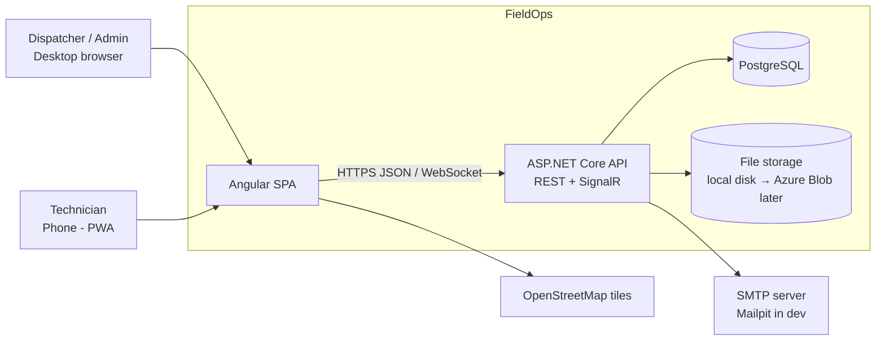
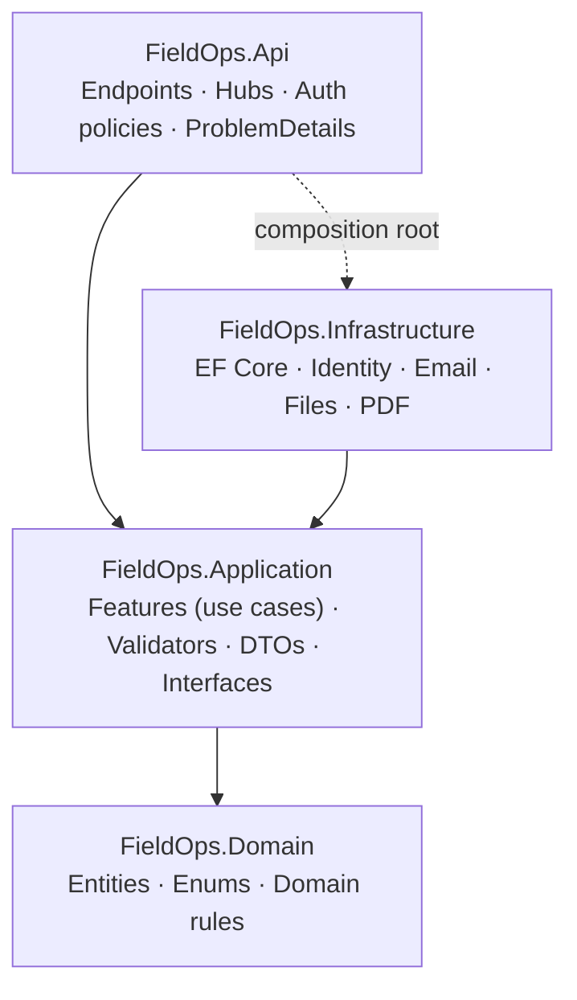
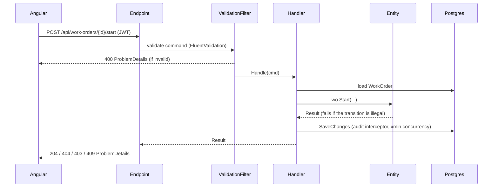

# 02 — Architecture

Style: a **modular monolith with Clean Architecture**. There is one deployable API, one Angular app, and one PostgreSQL database. That is enough for years of growth. Split things out only when there is a measured need.

## System context


## Layers


| Layer | Contains | Must NOT contain |
|---|---|---|
| Domain | Entities with behaviour (`WorkOrder.Dispatch()`), enums, `Result`/`Error` types | EF, ASP.NET, or any NuGet package |
| Application | One file per use case, `IAppDbContext`, `ICurrentUser`, `IEmailSender`, `IFileStorage`, `IPdfGenerator`, `INotifier`, DTOs | HTTP types or concrete infrastructure |
| Infrastructure | `AppDbContext`, entity configurations, migrations, implementations of the interfaces, identity/JWT token service | Business rules |
| Api | Minimal API endpoint groups, SignalR hub, DI wiring, middleware | Business rules or direct EF queries |

## Backend folder structure
```
src/FieldOps.Domain/
  Common/            Entity.cs, AuditableEntity.cs, Result.cs, Error.cs
  Customers/         Customer.cs, CustomerContact.cs, Site.cs
  Assets/            Asset.cs
  Technicians/       Technician.cs, Skill.cs, TimeOff.cs
  WorkOrders/        WorkOrder.cs, WorkOrderStatus.cs, WorkOrderTask.cs, WorkOrderNote.cs,
                     StatusHistory.cs, TimeEntry.cs, WorkOrderPart.cs, Attachment.cs
  Inventory/         Part.cs, StockLocation.cs, StockLevel.cs, StockMovement.cs
  Invoicing/         Invoice.cs, InvoiceLine.cs, InvoiceCalculator.cs
  Notifications/     Notification.cs

src/FieldOps.Application/
  Abstractions/      IAppDbContext.cs, ICurrentUser.cs, IEmailSender.cs, IFileStorage.cs,
                     IPdfGenerator.cs, INotifier.cs, ICommandHandler.cs, IQueryHandler.cs
  Common/            PagedResult.cs, PageRequest.cs, QueryableExtensions.cs
  Features/
    Customers/       CreateCustomer.cs, UpdateCustomer.cs, GetCustomer.cs, ListCustomers.cs, ...
    WorkOrders/      CreateWorkOrder.cs, AssignWorkOrder.cs, StartWorkOrder.cs, ...
    ...
  DependencyInjection.cs

src/FieldOps.Infrastructure/
  Persistence/       AppDbContext.cs, Configurations/, Migrations/, Interceptors/AuditInterceptor.cs,
                     NumberSequenceService.cs, DevSeeder.cs
  Identity/          AppUser.cs, JwtTokenService.cs, CurrentUser.cs
  Email/             SmtpEmailSender.cs
  Files/             LocalFileStorage.cs
  Pdf/               InvoicePdfGenerator.cs (QuestPDF)
  DependencyInjection.cs

src/FieldOps.Api/
  Endpoints/         AuthEndpoints.cs, CustomerEndpoints.cs, WorkOrderEndpoints.cs, ...
  Hubs/              NotificationsHub.cs, SignalRNotifier.cs
  Common/            ResultExtensions.cs (Result → IResult/ProblemDetails), EndpointFilters/ValidationFilter.cs
  Program.cs
```

### Example use case (the shape every feature follows)
```csharp
namespace FieldOps.Application.Features.WorkOrders;

public sealed record StartWorkOrderCommand(Guid WorkOrderId, double? Latitude, double? Longitude);

public sealed class StartWorkOrderHandler(IAppDbContext db, ICurrentUser user, TimeProvider clock, INotifier notifier)
    : ICommandHandler<StartWorkOrderCommand, Result>
{
    public async Task<Result> Handle(StartWorkOrderCommand cmd, CancellationToken ct)
    {
        var wo = await db.WorkOrders.FirstOrDefaultAsync(w => w.Id == cmd.WorkOrderId, ct);
        if (wo is null) return Errors.WorkOrder.NotFound;
        if (wo.AssignedTechnicianId != user.TechnicianId) return Errors.Forbidden;

        var result = wo.Start(user.UserId, clock.GetUtcNow(), cmd.Latitude, cmd.Longitude);
        if (result.IsFailure) return result;

        await db.SaveChangesAsync(ct);
        await notifier.WorkOrderStatusChanged(wo.Id, wo.Status, ct);
        return Result.Success();
    }
}
```

## Frontend structure (Angular)
```
web/src/app/
  core/            auth.service.ts, auth.interceptor.ts, error.interceptor.ts, role.guard.ts,
                   notifications.service.ts (SignalR), api-config.ts
  shared/          ui/ (page-header, confirm-dialog, status-chip, empty-state, map-picker),
                   models/ (paged-result.ts, enums.ts), pipes/ (dubai-time.pipe.ts)
  layout/          office-shell/ (sidenav + toolbar), tech-shell/ (mobile bottom nav)
  features/
    auth/          login
    dashboard/
    customers/     customer-list, customer-detail (tabs: info, sites, assets, work orders), customers.api.ts
    assets/
    technicians/
    work-orders/   wo-list, wo-detail, wo-form, work-orders.api.ts
    dispatch/      dispatch-board (tech rows × hours, CDK drag-drop), unassigned-panel
    inventory/     parts, stock, transfers
    invoices/
    settings/      users, skills, company settings
    tech/          my-jobs, job-detail, job-checklist, add-parts, signature-pad, time-tracker
  app.routes.ts    /login, /office/** (Admin|Dispatcher), /tech/** (Technician)
```
- After login, a technician is routed to `/tech/my-jobs`. Office staff go to `/office/dashboard`.
- The `/tech` routes are designed mobile-first. Installing the app as a PWA gives technicians an icon on their home screen.
- State is kept in signal-based services per feature. There is no global store.

## Request flow


## Authentication and authorization
- ASP.NET Core Identity stores users and roles. There is no public registration. Only an Admin can create users.
- `POST /api/auth/login` returns an **access token** (a JWT valid for 15 minutes) and a **refresh token** (valid for 7 days, stored hashed in `refresh_tokens`, and rotated on every use).
- The Angular interceptor attaches the bearer token. On a 401 it calls refresh once and retries the request.
- JWT claims: `sub` (user id), `role`, `technician_id` (for technicians only), and `name`.
- Policies: `AdminOnly`, `OfficeStaff` (Admin or Dispatcher), and `TechnicianOnly`. Ownership checks (a technician's own jobs) are done in handlers.

## Real-time (SignalR)
- There is one hub, `/hubs/notifications`, which authenticates with the same JWT (passed as the `access_token` query string).
- Groups are `user:{userId}` and `office` (all Admins and Dispatchers).
- Events:
  - `WorkOrderChanged {id, status}` goes to the `office` group and to the assigned technician. The dispatch board and lists refresh the affected item.
  - `NotificationCreated {notification}` goes to the target user and updates the bell icon.
- `INotifier` in Application hides SignalR from handlers.
- As built (Phase 9): handlers call the Application `Notifier`, which stores `Notification` rows and queues pushes and technician emails. `WorkOrderChanged` is raised by a `SaveChanges` interceptor for every saved work order, so no handler can forget it. Pushes and emails go out only after the save succeeds, and a failing push or email is logged, never surfaced to the user. Inside an explicit transaction a push can precede the commit; the client simply reloads.
- The Angular side is `core/realtime.ts` (connection, reconnects, `onWorkOrderChange()`) plus `features/notifications/` (store and bell), rather than a single `notifications.service.ts`.

## Security hardening (Phase 11)
- `/api/auth/*` is rate limited per client address (fixed window, `RateLimiting:Auth:PermitLimit` per `WindowSeconds`, default 10 per 60 s); over the limit returns 429 ProblemDetails with `Retry-After`.
- Every response carries `X-Content-Type-Options`, `X-Frame-Options: DENY`, `Referrer-Policy`, `Permissions-Policy` (geolocation and camera for the technician app only) and a Content-Security-Policy suited to the Angular build (Swagger, in Development, is exempt).
- Outside Development and tests: HSTS and HTTPS redirection. Behind a reverse proxy, list it in `ForwardedHeaders:KnownProxies` so client addresses and the scheme are taken from `X-Forwarded-*`.

## Files (photos, signatures, invoice PDFs)
- `IFileStorage` has `SaveAsync(stream, key)`, `OpenReadAsync(key)`, and `DeleteAsync(key)`. The MVP stores files on local disk under `/data/files/{yyyy}/{MM}/{guid}`.
- Photos are resized on the client to a maximum of 1600px before upload. The server limits uploads to 10 MB and allows only jpeg, png, webp, and pdf.
- Downloads go through `GET /api/attachments/{id}` with authorization checks. File paths are never served directly.

## Error model
All errors are RFC 9457 ProblemDetails:
```json
{ "type": "https://fieldops/errors/conflict", "title": "Invalid status transition",
  "status": 409, "detail": "Cannot start a work order in status 'Scheduled'.",
  "code": "WorkOrder.InvalidTransition", "errors": { } }
```
Mapping: Validation → 400, NotFound → 404, Forbidden → 403, Conflict or concurrency → 409.

## Deployment (simple)
- `Dockerfile` for the API. The Angular app is built into static files and served by the API (`UseStaticFiles` with a fallback to `index.html`), so the whole app runs in one container.
- Postgres can be managed (Azure Database for PostgreSQL or similar) or run as a container.
- Configuration comes from environment variables: `ConnectionStrings__Default`, `Jwt__Key`, `Smtp__*`, and `Files__Root`.
- CI (GitHub Actions) runs build, `dotnet test`, `npm test`, and `npm run build` on every pull request.
