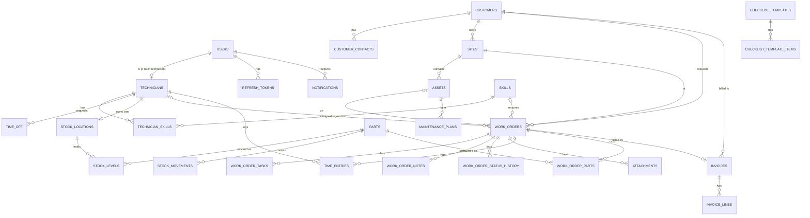

# 03 — Database (PostgreSQL)

Conventions:
- Names are snake_case. Primary keys are `id uuid` (v7).
- Timestamps are `timestamptz` in UTC. Money is `numeric(18,2)`. Enums are stored as `text` using EF `HasConversion<string>()` so they stay readable and easy to migrate.
- Every business table has audit columns: `created_at, created_by, updated_at, updated_by`. They are omitted from the column lists below.
- Concurrency uses Postgres `xmin` on `work_orders`, `invoices`, and `stock_levels`.

## ERD


## Tables

### Identity
| Table | Columns |
|---|---|
| `users` (Identity `AppUser`) | id, email (unique), user_name, full_name, phone_number, password_hash, is_active, … (Identity columns) |
| `roles`, `user_roles` | Standard Identity tables. The roles are Admin, Dispatcher, and Technician. |
| `refresh_tokens` | id, user_id FK, token_hash (unique), expires_at, created_at, revoked_at null, replaced_by_token_hash null |

### Customers
| Table | Columns |
|---|---|
| `customers` | id, code (unique, e.g. `C-00012`), name, type (`Individual`/`Business`), email, phone, tax_registration_number null, billing_address, notes, is_active |
| `customer_contacts` | id, customer_id FK, name, email, phone, job_title, is_primary |
| `sites` | id, customer_id FK, name, address_line1, address_line2, city, region (emirate), country (default `AE`), latitude null, longitude null, access_notes, is_active |

### Assets
| Table | Columns |
|---|---|
| `assets` | id, site_id FK, asset_type (`AC`, `Generator`, `Elevator`, `Pump`, `Other`…, stored as text), name, manufacturer, model, serial_number, install_date null, warranty_expires_on null, status (`Active`/`OutOfService`/`Retired`), notes, is_active |

### Technicians
| Table | Columns |
|---|---|
| `technicians` | id, user_id FK unique, employee_code unique, phone, color (hex for the dispatch board), hourly_cost numeric, working_hours_start time (default 08:00), working_hours_end time (default 17:00), is_active |
| `skills` | id, name unique |
| `technician_skills` | technician_id FK, skill_id FK, **PK (technician_id, skill_id)** |
| `time_off` | id, technician_id FK, starts_at, ends_at, reason, status (`Pending`/`Approved`/`Rejected`) |

### Work orders
| Table | Columns |
|---|---|
| `work_orders` | id, number unique (`WO-000123`), customer_id FK, site_id FK, asset_id FK null, required_skill_id FK null, title, description, type (`Repair`/`Installation`/`Maintenance`/`Inspection`), priority (`Low`/`Medium`/`High`/`Urgent`), status, due_by null, scheduled_start null, scheduled_end null, assigned_technician_id FK null, started_at null, completed_at null, completion_notes null, signed_by_name null, signature_attachment_id FK null, cancel_reason null, xmin |
| `work_order_tasks` | id, work_order_id FK, sort_order, description, is_done, done_at null, done_by null |
| `work_order_notes` | id, work_order_id FK, author_id FK users, body, is_internal (hidden from the customer PDF), created_at |
| `work_order_status_history` | id, work_order_id FK, from_status null, to_status, changed_by FK users, changed_at, note null, latitude null, longitude null |
| `attachments` | id, work_order_id FK, kind (`Photo`/`Document`/`Signature`), file_name, content_type, size_bytes, storage_key, uploaded_by, uploaded_at |
| `time_entries` | id, work_order_id FK, technician_id FK, type (`Travel`/`Work`), started_at, ended_at null, duration_minutes null (computed on stop) |
| `work_order_parts` | id, work_order_id FK, part_id FK, stock_location_id FK, quantity numeric(10,2), unit_price numeric (snapshot at time of use), stock_movement_id FK |
| `checklist_templates` | id, name, work_order_type null, is_active |
| `checklist_template_items` | id, template_id FK, sort_order, description |

### Inventory
| Table | Columns |
|---|---|
| `parts` | id, sku unique, name, description, unit (`pcs`/`m`/`kg`/`l`), unit_cost, unit_price, reorder_level, is_active |
| `stock_locations` | id, name, type (`Warehouse`/`Van`), technician_id FK null unique, is_active |
| `stock_levels` | part_id FK, stock_location_id FK, quantity numeric(10,2) CHECK (quantity >= 0), xmin, **PK (part_id, stock_location_id)** |
| `stock_movements` | id, part_id FK, type (`Receive`/`Transfer`/`Consume`/`Return`/`Adjust`), from_location_id null, to_location_id null, quantity (> 0), work_order_id null, reason null, created_by, created_at |

### Invoicing
| Table | Columns |
|---|---|
| `invoices` | id, number unique (`INV-000045`), work_order_id FK **unique**, customer_id FK, status (`Draft`/`Issued`/`Paid`/`Void`), issue_date null, due_date null, subtotal, vat_rate numeric(5,2), vat_amount, total, paid_at null, payment_reference null, void_reason null, pdf_attachment_key null, xmin |
| `invoice_lines` | id, invoice_id FK, line_type (`Labor`/`Part`/`Other`), description, quantity numeric(10,2), unit_price, line_total |

### System
| Table | Columns |
|---|---|
| `notifications` | id, user_id FK, type, title, body, link (a frontend route), is_read, created_at |
| `number_sequences` | name PK (`WorkOrder`, `Invoice`, `Customer`), next_value bigint. Incremented with `UPDATE … RETURNING` inside the same transaction. |
| `app_settings` | single row: company_name, company_address, trn (tax number), logo_key, vat_rate (default 5.00), labor_rate_per_hour, invoice_due_days (default 30), currency (default `AED`) |

### Later (designed, not built)
| Table | Columns |
|---|---|
| `maintenance_plans` | id, asset_id FK, name, interval_unit (`Day`/`Week`/`Month`), interval_value, next_due_on, checklist_template_id null, is_active |

## Indexes (beyond PKs and FKs)
- `work_orders (status)`, `work_orders (assigned_technician_id, scheduled_start)`, `work_orders (customer_id, created_at desc)`, `work_orders (site_id)`
- `customers (lower(name))` plus a trigram index on name for search (`pg_trgm`), `customers (phone)`
- `sites (customer_id)`, `assets (site_id)`, `assets (serial_number)`
- `time_off (technician_id, starts_at, ends_at)`
- `stock_movements (part_id, created_at desc)`
- `notifications (user_id, is_read, created_at desc)`
- `work_order_status_history (work_order_id, changed_at)`

## Enums (C#)
```csharp
public enum WorkOrderStatus { New, Scheduled, Dispatched, EnRoute, InProgress, OnHold, Completed, Invoiced, Cancelled }
public enum WorkOrderPriority { Low, Medium, High, Urgent }
public enum WorkOrderType { Repair, Installation, Maintenance, Inspection }
public enum InvoiceStatus { Draft, Issued, Paid, Void }
public enum StockMovementType { Receive, Transfer, Consume, Return, Adjust }
public enum StockLocationType { Warehouse, Van }
public enum TimeEntryType { Travel, Work }
public enum AttachmentKind { Photo, Document, Signature }
```

## Seed data (Development only)
- One user for each role, plus 3 technicians, each with their own van stock location.
- One `Main Warehouse`, and skills: HVAC, Electrical, Plumbing, and General.
- 10 customers in Dubai and Sharjah with sites and coordinates, and 15 assets.
- 20 parts with stock, and 15 work orders spread across all statuses.
- `app_settings` with VAT 5%, a labor rate of 150 AED/h, and currency AED.
