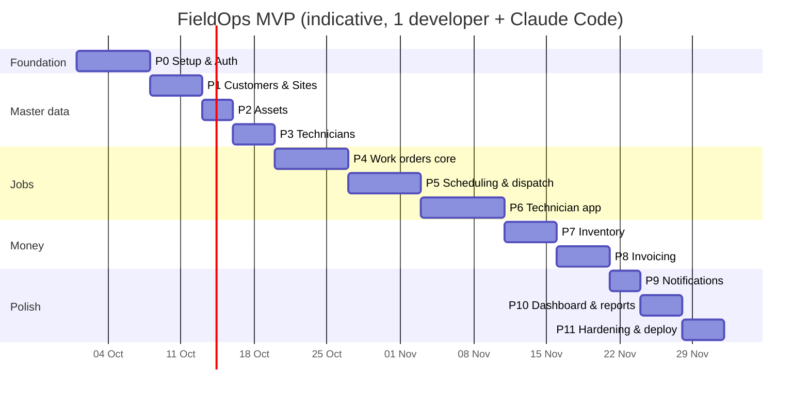

# 06 — Roadmap & Progress

Build the phases **in order**. Each phase ends with a working, tested vertical slice that can be demoed.
Tick `[x]` when a story is done, which means its backend, frontend, and tests are all green.

## Definition of Done (every story)
- [ ] Every acceptance criterion is covered by at least one test, and all tests pass (`dotnet test`, `npm test`)
- [ ] The endpoint has an authorization test (an allowed role and a forbidden role)
- [ ] The migration is added (if the schema changed) and applies cleanly to an empty database
- [ ] The UI screen works in the browser, and the technician screens are checked at a 360px width
- [ ] There are no compiler warnings, and there is no dead code or commented-out code
- [ ] A short summary of changes and deviations is written

---

## Phase 0 — Foundation
Goal: build the solution skeleton so that a user can log in and see a role-based shell.
- [x] Create the solution with 4 src projects and 3 test projects, plus `Directory.Build.props` (nullable, warnings as errors, and a .NET 10 target)
- [x] `docker-compose.yml` with postgres:17 and mailpit
- [x] Domain `Result`/`Error`, `Entity`, and `AuditableEntity`
- [x] Application handler interfaces with assembly-scan registration, `IAppDbContext`, `ICurrentUser`, `PagedResult`
- [x] `AppDbContext` with snake_case naming, the audit interceptor, `number_sequences`, `app_settings`, and the first migration
- [x] Api: ProblemDetails, `ResultExtensions`, `ValidationFilter`, Serilog, Swagger, CORS for :4200, and a health check at `/health`
- [x] Test infrastructure: a `PostgresFixture` (Testcontainers), `ApiFactory` (WebApplicationFactory), and an authenticated client helper for each role
- [x] Angular app: routing, Material theme, office shell and tech shell, auth service and interceptor, and role guards
- [x] GitHub Actions CI
- [x] US-AUTH-01 Log in
- [x] US-AUTH-02 Refresh / logout
- [x] US-AUTH-03 Manage users
- [x] US-AUTH-04 Change password
- [x] US-SET-01 Company settings
- [x] DevSeeder (users only for now)

**Demo:** the Admin logs in, creates a technician user, and that technician logs in and lands on an empty "My jobs" screen.

## Phase 1 — Customers & Sites
- [x] US-CUS-01 Create customer
- [x] US-CUS-02 Search/list
- [x] US-CUS-03 Customer detail (tabs; empty tabs for future features are fine)
- [x] US-CUS-04 Edit/deactivate (the open-work-order rule is added in P4 once work orders exist; leave a TODO test)
- [x] US-CUS-05 Contacts
- [x] US-SITE-01 Add site with map pin (the shared `map-picker` component)
- [x] US-SITE-02 Edit/deactivate site

## Phase 2 — Assets
- [x] US-AST-01 Register asset
- [x] US-AST-02 Asset history (the endpoint returns an empty list until P4)
- [x] US-AST-03 Warranty badge

## Phase 3 — Technicians
- [x] US-TEC-01 Technician profile
- [x] US-TEC-02 Skills
- [x] US-TEC-03 Time off request/approve
- [x] US-TEC-04 Technician list with availability

## Phase 4 — Work Orders core
- [x] `WorkOrder` aggregate and state machine with **full transition-table unit tests** (see 07-flows)
- [x] US-WO-01 Create (number sequence and checklist template copy)
- [x] US-WO-02 List/filter
- [x] US-WO-03 Detail page
- [x] US-WO-04 Edit (with concurrency)
- [x] US-WO-05 Tasks/checklist
- [x] US-WO-06 Notes
- [x] US-WO-07 Status workflow endpoints (the Office-side actions)
- [x] US-WO-08 Cancel
- [x] US-WO-09 Status timeline
- [x] Complete the deferred rules: CUS-04 AC1, SITE-02, and AST-02

## Phase 5 — Scheduling & Dispatch
- [x] US-DSP-01 Assign & schedule (overlap, time-off, and skill checks)
- [x] US-DSP-04 Unassign
- [x] US-DSP-03 Dispatch / dispatch day
- [x] US-DSP-02 Dispatch board (CDK drag-drop and resize; live updates arrive in P9, so use manual refresh for now)
- [x] US-DSP-05 Map view

## Phase 6 — Technician app
- [x] US-TAPP-01 My jobs
- [x] US-TAPP-02 Job detail
- [x] US-TAPP-03 On my way
- [x] US-TAPP-04 Start
- [x] US-TAPP-05 Hold
- [x] US-TAPP-06 Photos (`IFileStorage`, `LocalFileStorage`)
- [x] US-TAPP-09 Time log
- [x] US-TAPP-08 Complete with signature (the parts step is added in P7)
- [x] US-TAPP-10 PWA manifest, service worker, and offline banner
- [x] Playwright E2E: dispatcher creates and schedules a job, then the technician goes en-route, starts, and completes it

## Phase 7 — Parts & Inventory
- [x] US-INV-01 Parts catalog
- [x] US-INV-02 Stock by location
- [x] US-INV-03 Receive
- [x] US-INV-04 Transfer
- [x] US-INV-05 Adjust
- [x] US-INV-06 Movement history
- [x] US-TAPP-07 Record parts used on a job (plus the Return-on-cancel rule in WO-08)
- [x] Concurrency test: two technicians consuming the last units at the same time, so that one succeeds and one gets 409

## Phase 8 — Invoicing
- [x] `InvoiceCalculator` domain tests (rounding, the 0.25h labor rounding, VAT)
- [x] US-BIL-01 Generate draft
- [x] US-BIL-02 Edit draft lines
- [x] US-BIL-03 Issue
- [x] US-BIL-04 PDF (QuestPDF)
- [x] US-BIL-05 Mark paid
- [x] US-BIL-06 Void
- [x] US-BIL-07 Invoice list
- [x] Extend the E2E test: complete a job, then generate and issue the invoice, then download the PDF

## Phase 9 — Notifications
- [x] SignalR hub, `INotifier`, and the Angular `notifications.service`
- [x] US-NOT-01 Bell and list
- [x] US-NOT-02 All events in the table (and the email template for technicians)
- [x] Live updates on the dispatch board and work order lists (completes DSP-02 AC5)

## Phase 10 — Dashboard & Reports
- [x] US-DSH-01 Dashboard
- [x] US-RPT-01 Technician report + CSV
- [x] US-RPT-02 Revenue report + CSV
- [x] US-RPT-03 Parts usage report

## Phase 11 — Hardening & Deploy
- [ ] Complete the seed data set (03-database)
- [ ] Rate limiting on `/auth/*`, security headers, and HTTPS redirection
- [ ] Dockerfile (API serves the Angular build), with production config from environment variables
- [ ] Backup note for Postgres, and a README with run and deploy steps
- [ ] Manual test pass of every epic on a phone and a desktop

## Later
Preventive maintenance → Customer portal → Offline mode → Multi-technician jobs → Quotes → Arabic/RTL
