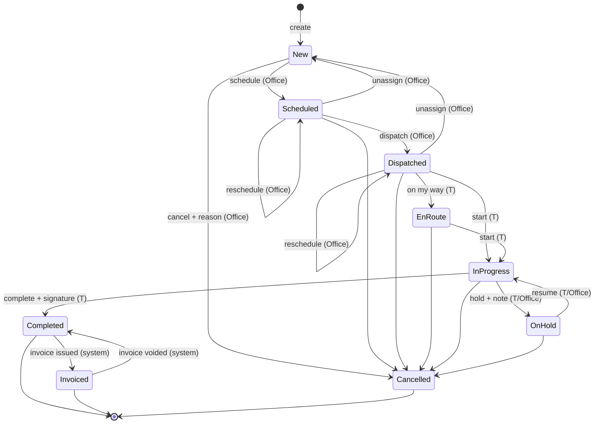
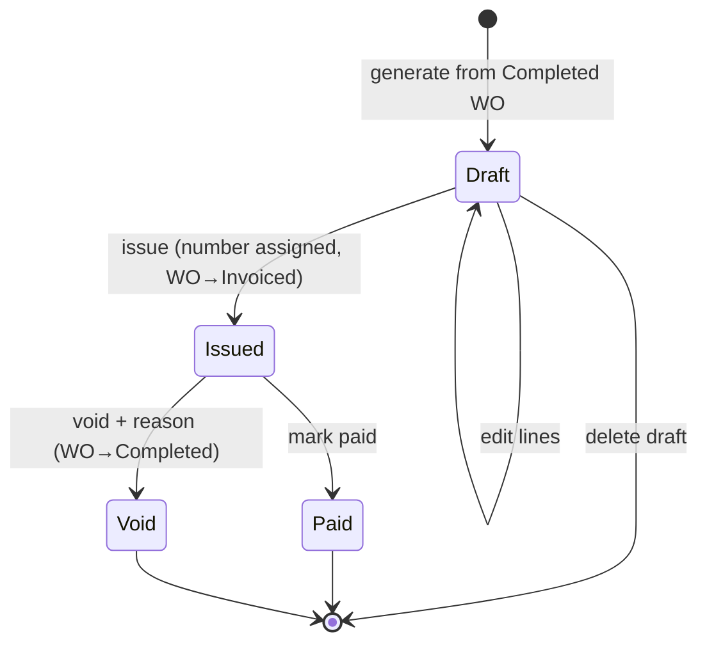
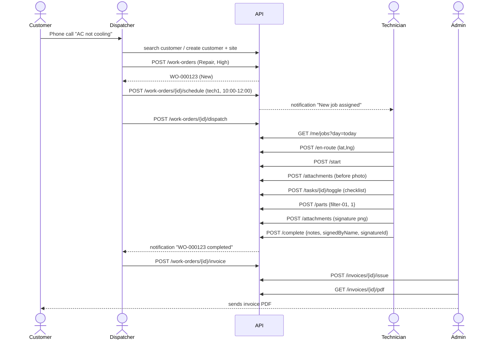
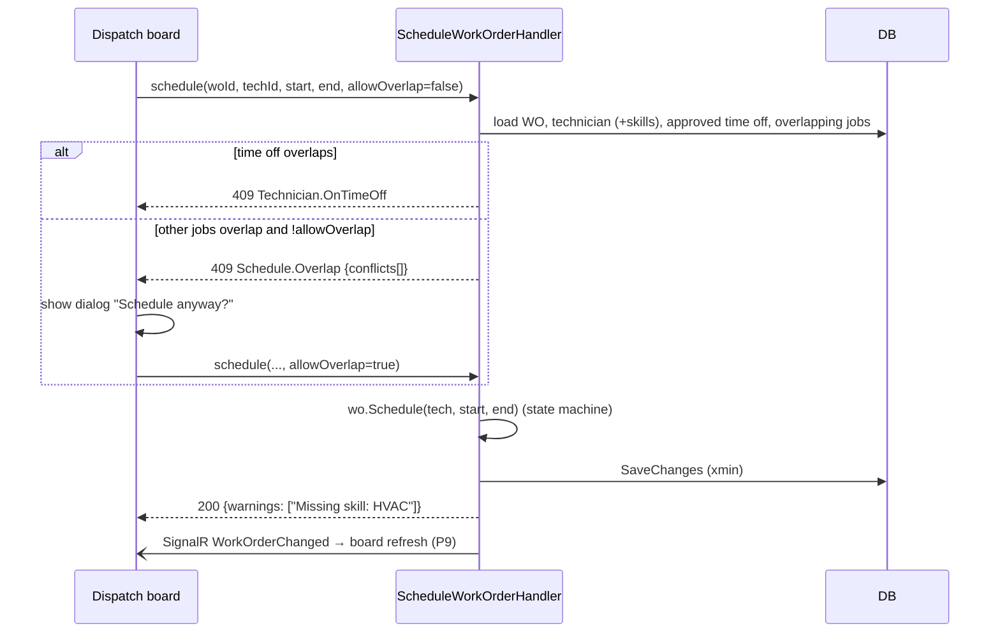
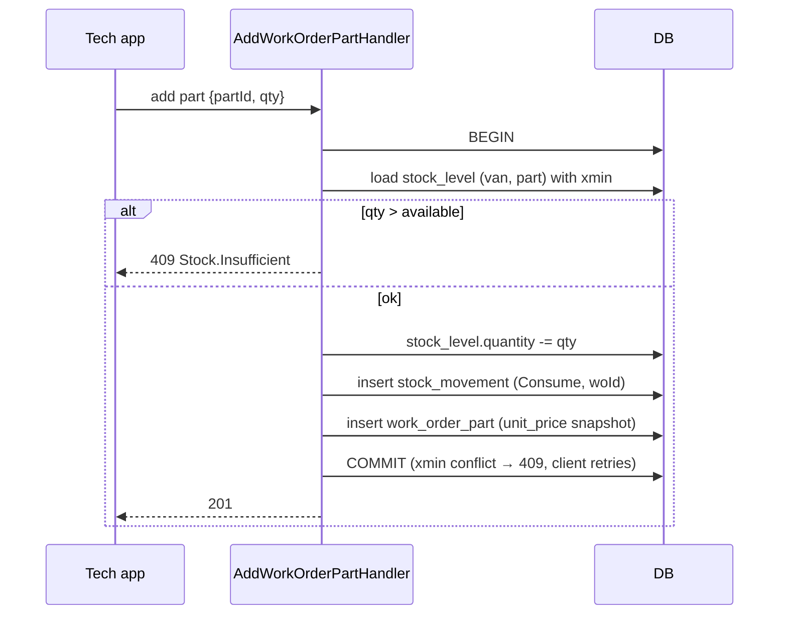
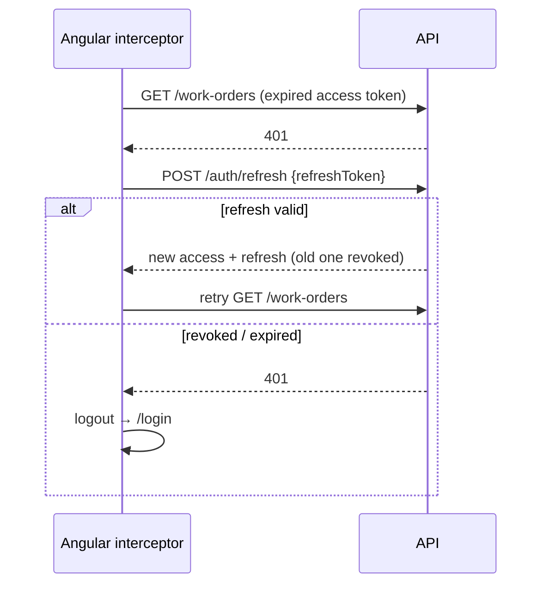
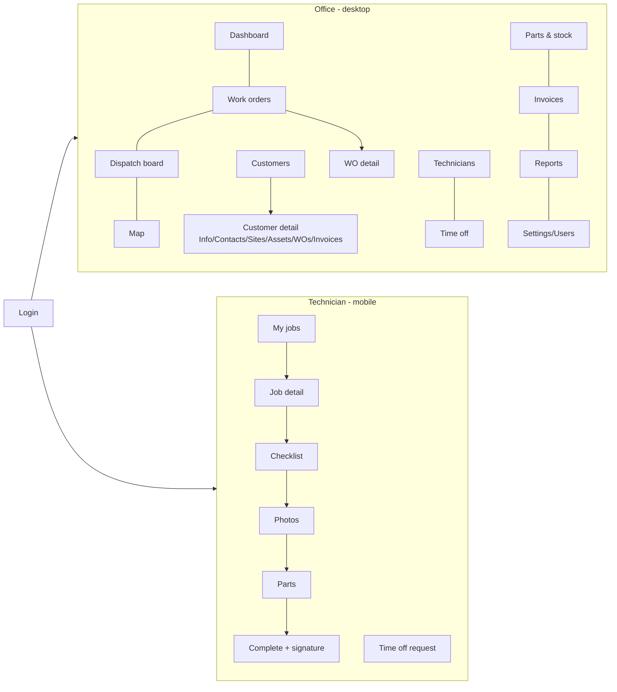

# 07 — Flows & Diagrams

## 1. Work order state machine


### Transition table (the source for `WorkOrder` domain tests)
| From \ Action | schedule | unassign | dispatch | enRoute | start | hold | resume | complete | cancel | invoice | voidInvoice |
|---|---|---|---|---|---|---|---|---|---|---|---|
| New | ✅→Scheduled | ❌ | ❌ | ❌ | ❌ | ❌ | ❌ | ❌ | ✅ | ❌ | ❌ |
| Scheduled | ✅ (stay) | ✅→New | ✅→Dispatched | ❌ | ❌ | ❌ | ❌ | ❌ | ✅ | ❌ | ❌ |
| Dispatched | ✅ (stay) | ✅→New | ❌ | ✅→EnRoute | ✅→InProgress | ❌ | ❌ | ❌ | ✅ | ❌ | ❌ |
| EnRoute | ❌ | ❌ | ❌ | ❌ | ✅→InProgress | ❌ | ❌ | ❌ | ✅ | ❌ | ❌ |
| InProgress | ❌ | ❌ | ❌ | ❌ | ❌ | ✅→OnHold | ❌ | ✅→Completed | ✅ | ❌ | ❌ |
| OnHold | ❌ | ❌ | ❌ | ❌ | ❌ | ❌ | ✅→InProgress | ❌ | ✅ | ❌ | ❌ |
| Completed | ❌ | ❌ | ❌ | ❌ | ❌ | ❌ | ❌ | ❌ | ❌ | ✅→Invoiced | ❌ |
| Invoiced | ❌ | ❌ | ❌ | ❌ | ❌ | ❌ | ❌ | ❌ | ❌ | ❌ | ✅→Completed |
| Cancelled | ❌ | ❌ | ❌ | ❌ | ❌ | ❌ | ❌ | ❌ | ❌ | ❌ | ❌ |

Implementation tip: keep one private dictionary in `WorkOrder` that maps `(Status, Action)` to the next status, and one `Transition(action, userId, now, note, lat, lng)` method. Every public method (`Start`, `Hold`, …) checks its preconditions, for example that a signature is present, and then calls `Transition`. The domain test is then one `[Theory]` over the whole table above.

Side effects per transition, handled in the entity or handler:
| Transition | Side effects |
|---|---|
| → Scheduled | set technician and times, notify T |
| → New (unassign) | clear technician and times, notify T |
| → EnRoute | start Travel time entry |
| → InProgress (start) | `started_at` (first time only), stop Travel, start Work |
| → OnHold | stop Work, note required, notify Office |
| OnHold → InProgress | start Work |
| → Completed | stop Work, `completed_at`, notes and signature required, notify Office |
| → Cancelled | reason required, parts must be returned first, stop open entries, notify T |

## 2. Invoice state machine


## 3. Happy path: phone call to invoice


## 4. Schedule with conflict checks


## 5. Consume part (stock safety)


## 6. Auth token refresh


## 7. Screen map


## 8. Wireframes (low-fi)

**Dispatch board**
```
┌ Unassigned (4) ─────┐ ┌ ◀  Sun 04 Oct 2026  ▶ ─────────────────────────────────────────────┐
│ ● WO-131 URGENT     │ │           07  08  09  10  11  12  13  14  15  16  17  18  19        │
│   Al Nahda · AC     │ │ Ahmed K.  ░░░░[WO-120 ████]      [WO-124 ██████]                    │
│ ● WO-129 HIGH       │ │ Ravi S.        [WO-122 ███████████]   ▒▒▒▒ time off ▒▒▒▒▒▒▒▒        │
│   Muwaileh · Pump   │ │ Omar F.   [WO-118 ██] [WO-125 ███]          [WO-127 █████]          │
│ ○ WO-128 MEDIUM     │ └─────────────────────────────────────────────────────────────────────┘
└ drag onto a row ────┘   block color = priority · border = status · click = WO detail drawer
```

**Tech app: job detail (360px)**
```
┌──────────────────────────┐
│ ← WO-000123     HIGH     │
│ AC not cooling           │
│ Status: DISPATCHED       │
│ 10:00 – 12:00            │
├──────────────────────────┤
│ 👤 Sara M.  📞 Call       │
│ 📍 Villa 12, Al Nahda     │
│ Gate code 4411 [Navigate]│
│ 🔧 Carrier 2.5T · SN…     │
│ History (3) ›            │
├──────────────────────────┤
│ Checklist 1/4 ›          │
│ Photos (0) ›  Parts (0) ›│
│ Notes (2) ›              │
├──────────────────────────┤
│ [   ON MY WAY   ]        │  ← primary button changes with status
└──────────────────────────┘
```
