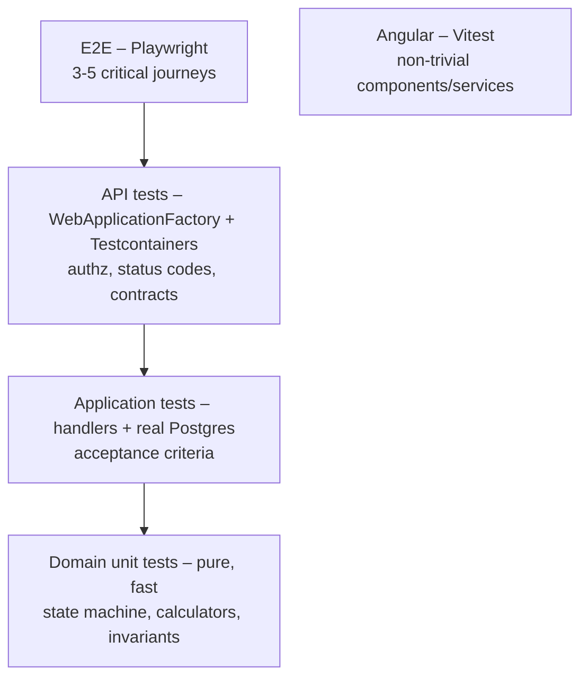

# 08 — Testing Strategy

The goal is **confidence per story, with no testing theatre**. Test the behavior in the acceptance criteria, the state machine, the money math, and authorization. Do not test EF or framework plumbing.



| Layer | Project | What to test | Tools |
|---|---|---|---|
| Domain | `FieldOps.Domain.Tests` | the whole transition table, `InvoiceCalculator` rounding, stock never negative, validation inside entities | xUnit, Shouldly |
| Application | `FieldOps.Application.Tests` | each handler against its AC: happy path, NotFound, Conflict, T ownership (Forbidden) | + Testcontainers (Postgres), `FakeTimeProvider`, NSubstitute for `IEmailSender`/`INotifier`/`IFileStorage` |
| API | `FieldOps.Api.Tests` | routing, JSON contract, ProblemDetails shape, **authorization matrix**, 401/403, file upload limits, concurrency 409 | WebApplicationFactory, Testcontainers |
| Frontend | `web/**/*.spec.ts` | guards, interceptor refresh logic, dispatch board time↔pixel math, form validators | Vitest, Angular TestBed |
| E2E | `web/e2e` | P6: create, schedule, and complete a job; P8: then invoice it and download the PDF; login redirects per role | Playwright |

## Test infrastructure (built in Phase 0)
- `PostgresFixture` starts one Postgres container per test assembly (`ICollectionFixture`) and applies migrations once.
- Isolation: each test starts by **resetting the database with Respawn**, which is fast and simple. Alternatively, each test can run inside a transaction that is rolled back. Pick one approach and use it everywhere.
- `TestData` builders provide fluent helpers such as `await Given.Customer().WithSite().SaveAsync(db)` so tests stay short.
- `ApiFactory : WebApplicationFactory<Program>` replaces the connection string, `TimeProvider`, `IEmailSender`, and `IFileStorage` (with in-memory storage).
- `ApiFactory.CreateClientAs(Role.Dispatcher)` or `.CreateClientAsTechnician(techId)` returns an `HttpClient` with a real JWT.

## Examples
```csharp
// Domain – the state machine driven by the table in 07-flows.md
[Theory]
[InlineData(WorkOrderStatus.Dispatched, true)]
[InlineData(WorkOrderStatus.EnRoute, true)]
[InlineData(WorkOrderStatus.Scheduled, false)]
[InlineData(WorkOrderStatus.Completed, false)]
public void Start_is_only_allowed_from_dispatched_or_en_route(WorkOrderStatus from, bool allowed)
{
    var wo = WorkOrderMother.InStatus(from);
    var result = wo.Start(UserId, Now, null, null);
    result.IsSuccess.ShouldBe(allowed);
    if (allowed) wo.Status.ShouldBe(WorkOrderStatus.InProgress);
}

// Application – an acceptance criterion against real Postgres
[Fact]
public async Task Adding_part_with_quantity_above_van_stock_returns_conflict_and_keeps_stock()
{
    var (tech, van) = await Given.TechnicianWithVan().SaveAsync(Db);
    var part = await Given.Part().WithStock(van, 2).SaveAsync(Db);
    var wo = await Given.WorkOrder().AssignedTo(tech).InStatus(WorkOrderStatus.InProgress).SaveAsync(Db);

    var result = await Handler(asTechnician: tech).Handle(new AddWorkOrderPartCommand(wo.Id, part.Id, 3), default);

    result.Error.Code.ShouldBe("Stock.Insufficient");
    (await StockOf(part, van)).ShouldBe(2);
}

// API – authorization matrix
[Theory]
[InlineData(Role.Admin, HttpStatusCode.Created)]
[InlineData(Role.Dispatcher, HttpStatusCode.Created)]
[InlineData(Role.Technician, HttpStatusCode.Forbidden)]
public async Task Create_customer_authorization(Role role, HttpStatusCode expected)
{
    var client = Factory.CreateClientAs(role);
    var res = await client.PostAsJsonAsync("/api/customers", new { name = "Acme", phone = "+971500000000", type = "Business" });
    res.StatusCode.ShouldBe(expected);
}
```

## Must-have test lists
- **Every story:** at least one test per AC, plus an authorization test for each endpoint.
- **Work orders:** the full transition table; T accessing another T's job gets 403; the concurrent edit gets 409.
- **Scheduling:** time-off block, overlap warning or override, skill warning, and the duration limits.
- **Stock:** receive, transfer, consume, return, and adjust; never negative; parallel consumption (one succeeds, one gets 409).
- **Invoice:** the labor rounding (for example 70 min → 1.25h), a VAT example (subtotal 187.50 × 5% = 9.38), the "once per WO" rule, and void enabling re-invoicing.
- **Auth:** lockout, refresh rotation, reuse of a revoked token, and an inactive user.

## Commands
```bash
dotnet test                                   # all backend tests (Docker must be running)
dotnet test --filter "FullyQualifiedName~WorkOrders"
cd web && npm test
cd web && npx playwright test --ui
```
